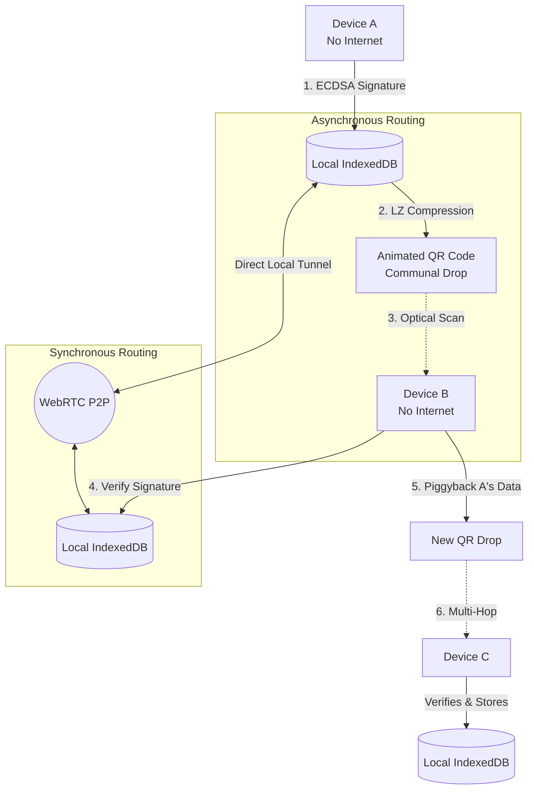

# MeshRelay 🌐 

**Zero-Infrastructure Disaster Comms**

An offline-first, peer-to-peer web application designed for civilians in a fully network-blackout environment. When cellular towers fall and the internet is cut, MeshRelay enables secure, multi-hop information routing using only the hardware already in your pocket: **your browser and your camera.**

---

## 🎯 The Problem Solved
> *"Design an offline-first web application that enables civilians in a fully network-blackout environment to share, relay, and access critical information using peer-to-peer local communication and QR-based communal data drops."*

**How MeshRelay perfectly meets the requirements:**
* **Zero Internet Functionality:** Built entirely as an offline-first PWA. Once loaded, it caches itself in the browser and requires zero external servers.
* **Dual Transport Layer:** Features an **Optical Mesh** (QR data drops) for asynchronous sharing, and **WebRTC Tunnels** for synchronous local P2P.
* **Multi-Hop Propagation:** Implements an Epidemic Routing (Gossip) protocol. Device A scans a message to Device B. When Device B meets Device C, B automatically relays A's original message.
* **Consumer Hardware:** Runs purely in mobile browsers (Chrome/Safari). No native `.apk` downloads, no Bluetooth pairing permission hurdles, and low resource drain.

---

## 🏗️ System Architecture

MeshRelay uses a decentralized, cryptographically secure mesh architecture. Every browser acts as an independent Node.

### 1. Optical Mesh (Communal Data Drops)
Because browsers cannot silently scan local networks due to security sandboxes, MeshRelay uses light as the primary transport mechanism.
* Messages are serialized into JSON, highly compressed via `LZString`, and chunked into base64 frames.
* The device broadcasts these frames as an animated sequence of high-contrast QR codes.
* Any nearby device can use its camera to ingest the sequence, reassemble the chunks, and verify the cryptographic signature.

### 2. Real-Time Tunnels (WebRTC)
For high-bandwidth scenarios (e.g., users sitting together in a bunker), users can establish a direct local tunnel.
* Device A generates a massive SDP Offer (connection locks/IP). 
* Instead of needing the internet to share this key, **Device A converts the SDP Key itself into a QR Code**.
* Device B scans it, and they establish an invisible, bidirectional background sync tunnel.

### 3. Cryptographic Trust
To prevent bad actors from tampering with relayed messages:
* On initialization, every device generates an **ECDSA P-256 Keypair** via the native Web Crypto API.
* Every message is uniquely signed. If Device C receives Device A's message relayed through Device B, Device C verifies A's original signature. If it fails, the message is silently dropped.

---

## 🚀 How to Demo for Judges

To properly demonstrate the multi-hop capabilities of the system, we recommend using two phones.

**Scenario 1: The Optical Drop (Stranger Passing By)**
1. On **Phone A**, go to `Create Data Drop`. Type an emergency message ("Need medical supplies at Main St").
2. Check the box to *"Piggyback unseen messages"* (this enables the Gossip Protocol).
3. On **Phone B**, go to `Scan Data Drop`. Point the camera at Phone A's flashing QR code.
4. Watch Phone B instantly verify and ingest the message into its local Feed!

**Scenario 2: The Direct Tunnel (Establishing a Base)**
1. On **Phone A**, go to `WebRTC Link` and click **Host Connection**.
2. On **Phone B**, go to `WebRTC Link`, click **Join Connection**, and tap the camera icon to scan Phone A's code.
3. Phone B will generate an Answer QR. Scan it with Phone A.
4. You are now connected! Go to the `Feed` tab on both phones. 
5. Any message typed on Phone A will now magically appear on Phone B in exactly 3 seconds, silently synced through the air without internet or QR codes.

**Scenario 3: The Algorithm (Mesh Sim)**
1. Open the `Mesh Sim` tab on a large screen or laptop.
2. This is a visual sandbox demonstrating how the underlying Gossip algorithm works at scale with up to 26 devices.
3. Toggle connections and watch how messages "hop" efficiently without infinite loops.

---

## 🛠️ Tech Stack
* **Framework:** React 19 + Vite (PWA)
* **Storage:** Dexie.js (IndexedDB for persistent offline storage)
* **Crypto:** Native Web Crypto API (ECDSA P-256)
* **Compression:** LZ-String (Base64 chunking for QR density control)
* **Styling:** Tailwind CSS v4 (Glassmorphism & High Contrast Dark Mode)
